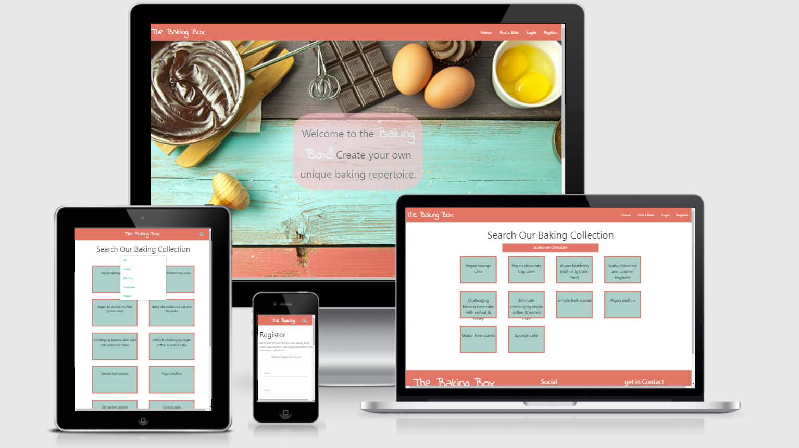
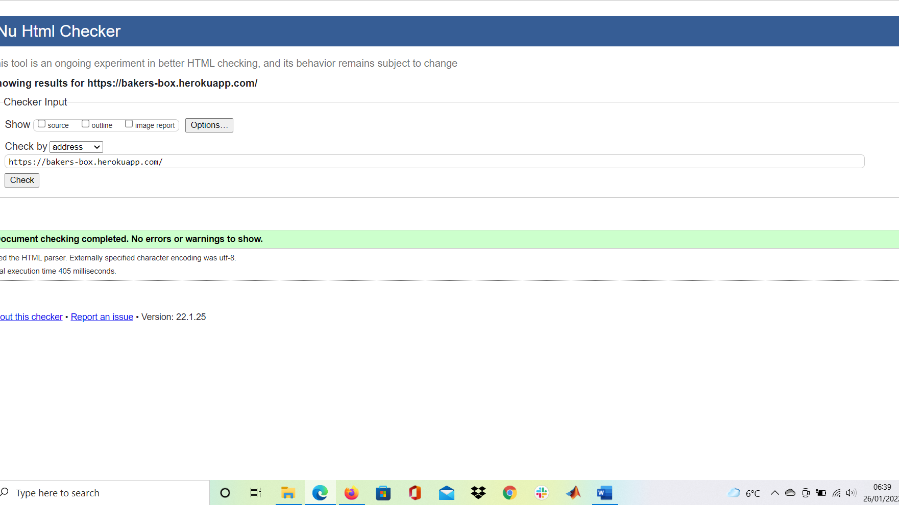
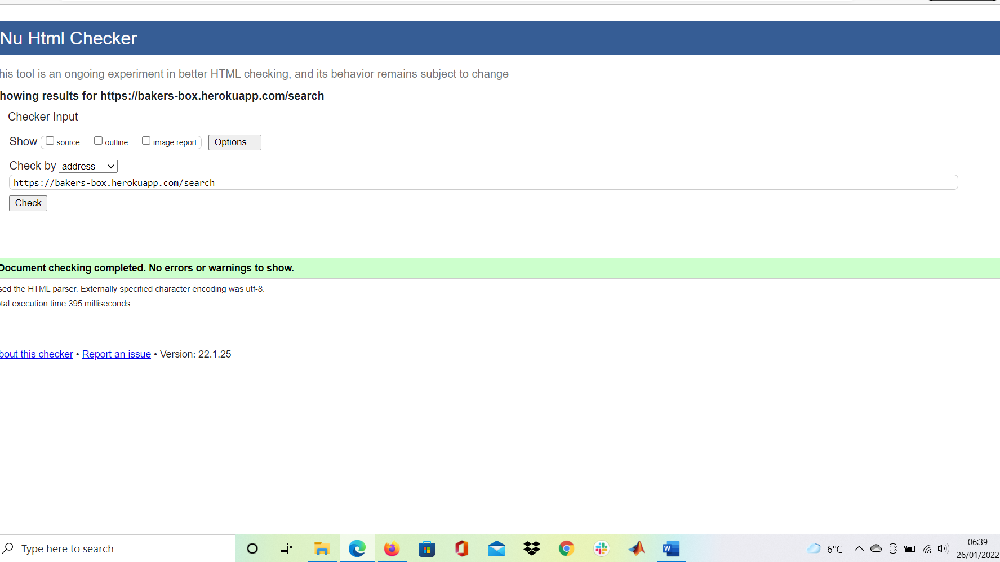
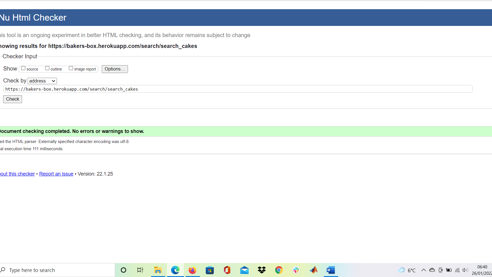
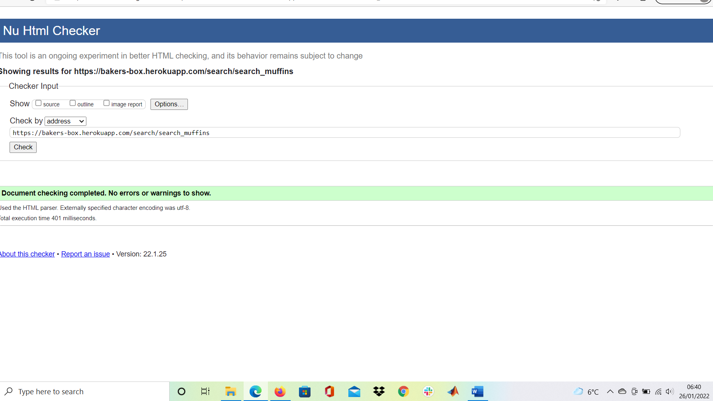
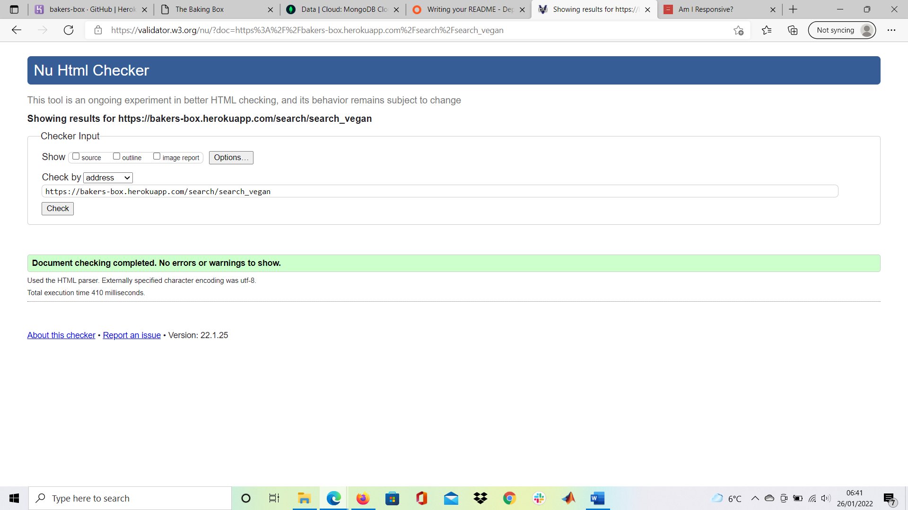
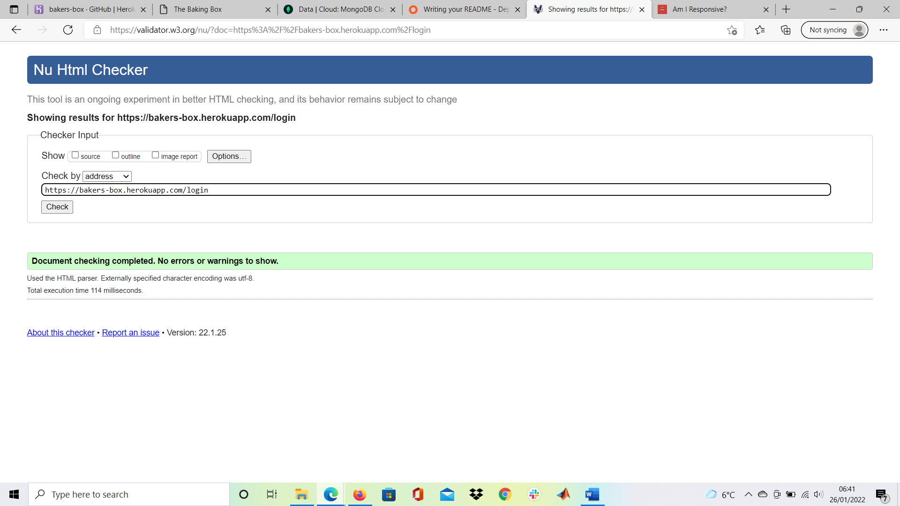
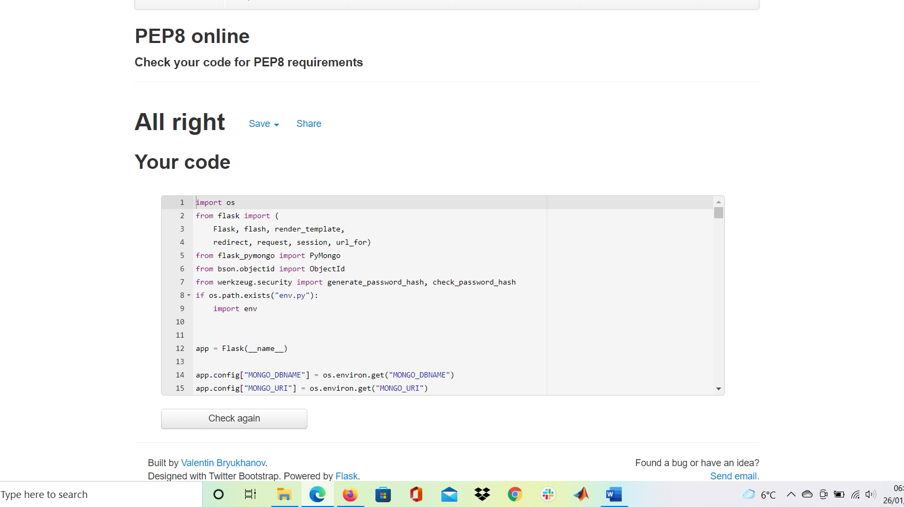

<h1 align="center">The Baking Box</h1>

[View the live project here.](https://bakers-box.herokuapp.com/)

A simple application making finding a new baking challenge easier.  The user can find new bakes to complete with full recipes in the "Find a Bake" section and registerring allows the registerred user to save bakes that they plan on completing later and add their own new bakes to the community.

## User Experience Goals (UX)
1. The site should be simple to understand and easy to engage with, even without detailed reading of the instructions.
2. The content should meet the users want to find a new bake easily and without interuption 
3. The atmosphere of the background and interactions should be undistracting and subdued, so that the user can focus on the text that for recipes can be quite substantial.
4. The user will want a option for marking recipes they will want to use later
5. The user should be able to add recipes easily adding the options they wish.

## Design
-   ### Wireframes
    The wireframes from the initial design concept stage can be found here detailing all pages of the site. These design stay mainly tue to what the end product was.
    - [Home Page](static/imgs/wireframes/home.png)
    - [Login](static/imgs/wireframes/login.png)
    - [Register](static/imgs/wireframes/register.png)
    - [Find a Bake](static/imgs/wireframes/findabake.png)
    - [Example Recipe](static/imgs/wireframes/item.png)
    - [My Baking Box](static/imgs/wireframes/mybakingbox.png)

-   ### Color and Style Selection
    The approach to the style of the site was minimalist so that the user can be fully focused on the content.  The color scheme is primarily based around the home image of orange and cyan, which seemed quite easy on the eyes.  All buttons are styled to hint at their purpose with serioues actions such as deleting a recipe marked in red and submit buttons being green.  Both the footer and the nav area remain the same for consistency 

-   ### Features
    -   #### Home Page
    The first page a new user will see, offerring a distinctive and relevent image to immediently inform the user of the sites purpose.  A new user will likely want to get into viewing recipes without interference, hence beneath the key image is the category section which links to the find a bake section directly so the user if spotting a category appealiling can quickly move to that section
    -   #### Find a Bake 
    The search area displays all the added bakes with the unique names displayed.  The recipes can then be searched using a category dropdown menu.
    -   #### My Baking Box
    The keynote feature of the site offers the user the ability to store bakes that are planned once they are registerred and signed in.  The owned recipe area is also present inviting the user to create their own recipe.  From here editting and deleting a created recipe is easy.  

    -   #### Future Features 
    In the future, given more time the ability to add imgs to recipes and display these images on the recipe cards during search.  Aslo adding a word input search area would be useful once the recipes increase beyond category management.

## Technologies Used

### Languages Used

1. [HTML5:](https://en.wikipedia.org/wiki/HTML5)
   - HTML5 was used for the sturcture of the webpages.
2. [CSS3:](https://en.wikipedia.org/wiki/Cascading_Style_Sheets)
   - CSS3 was used for the styling and responsive elements.
3. [JavaScript:](https://en.wikipedia.org/wiki/JavaScript)
   - JavaScript was minorly used for some materialize element initiation.
4. [Python:](https://en.wikipedia.org/wiki/Python_(programming_language))
   - This was used to create the majority of logic in the application and is responsible for communicating between the database and the webpage. 

### Frameworks, Libraries & Programs Used

## Libraries, Frameworks and programs
- #### [GitHub](https://en.wikipedia.org/wiki/GitHub):
    This was used for version control, all stages of the project are documented on my github account.

- #### [Gitpod]((https://www.gitpod.io/docs)):
    This was used as the development environment for the entire project.

- #### [FontAwesome](https://en.wikipedia.org/wiki/Font_Awesome):
    This was used for a number of icons throughout the app, to increase the UX and intuitiveness.

- #### [Materialise](https://materializecss.com/about.html):
    This was used as a mix of HTML, CSS and JavaScript for a lot of the features on the app, including; colors, buttons, collapsibles, nav bars and form elements. 

- #### [Flask](https://en.wikipedia.org/wiki/Flask_(web_framework)):
    This was used for the creation of the app itself.

- #### [MongoDB](https://en.wikipedia.org/wiki/MongoDB):
    This was used as the database for the app.

- #### [Werkzeug](https://werkzeug.palletsprojects.com/en/2.0.x/):
    This was used to create secure passwords for users accounts.

- #### [Heruko](https://en.wikipedia.org/wiki/Heroku):
    This was used to host the app.

- #### [JQuery](https://en.wikipedia.org/wiki/JQuery):
    This was used in conjuncture with some of the materialize components.

- #### [Jinja](https://jinja.palletsprojects.com/en/3.0.x/):
    This was used to add logic to the HTML and dynamically populate each page with the appropriate data from the database. 

- #### [AmIResponsive](http://ami.responsivedesign.is/):
    Allows for the creation of a responsive mockup

# Testing
## User stories Resolved

1. The site should be simple to understand and easy to engage with, even without detailed reading of the instructions.
 
    - The home page is clear about the purpose of the site.  
    - The minimalist design allows user to read the recipe easily.
    - All forms have labels that are clear as to what input is needed.
    - All actions have immediate feedback with flash messages confirming action sucess
    - The site is kept simple and uncomplicated.

2. The content should meet the users want to find a new bake easily and without interuption 

    - Navigation to search is easy and all is displayed by default
    - My Baking Box is easy to navigate 
    -Easy to return to the search from recipes

3. The atmosphere of the background and interactions should be undistracting and subdued, so that the user can focus on the text that for recipes can be quite substantial.
    - The site is minimalist with white background allowing for easy viewing and avoiding any clutter that could distract the user from the recipe.

4. The user will want a option for marking recipes they will want to use later

    - The My Box area explains that to save planned bakes you do so in the recipe view
    - Once clicked the green add button in the recipe sheet disappears and is replaced with an orange remove
    - All the planned bakes can be accessed via the dropbox

5. The user should be able to add and edit or delete recipes easily adding the options they wish.

    - Color coded buttons allow easy interaction with db

## feature and Logic testing

-   The two primary places of testing were on developer tools on mozilla firefox and microsoft edge, using the element selector most positioning, margin and padding issues were tested here first.
-   The Website was tested on Google Chrome, Internet Explorer, and Safari browsers also.
-   The website was viewed on a variety of devices such as Desktop, Laptop, iPhone7, iPhone 8 & iPhoneX and resized from a large range of sizes in web developer tools to ensure responsive design across the board.
-   A large amount of testing was done to ensure that all pages were linking correctly.
-   logs in the console allowed for viewing of arrays and variables in developer tools to ensure the logic was performing correctly.
-   Friends and family members were asked to review the site and documentation to point out any bugs and/or user experience issues.
-   All possible combinations of DB interactions were trialled repeatedly with monitorring on MongoDB, subsequent logins and log outs and users adding different combinations to the forms was tried.  
-   In the bugs section some of these db interacting checks are described further.

## Data-base

In Mongo db the database was created (see deployment).
There was only need for Two collections 
-   users
-   recipes

The collection interactted with each other as follows:
-   User;name- (1:N) -recipe;added_by
-   Users;own_recipes- (N:M) recipes;_ id
-   planned_recipes- (N:M) -recipes;_ id

## Code validation

- HTML
    - My HTML files were checked using [W3C validator](https://validator.w3.org/#validate_by_uri) 

    
    
    
    
    
    
    

- CSS
    - My CSS files were checked using [W3C CSS validator](https://jigsaw.w3.org/css-validator/) 

    

- Python
    - My JS files were checked using [PEP8](http://pep8online.com/)

    
    Warning is necessary for game logic

# Bug Fixes and Problems Encountered

###  - Bug: 
Unable to handle empty pymongo arrays
###  - Fix: 
During the creation of a new user a couple of empty arrays were created to contain the recipes that were later added to them.  They functioned fine when full but not when empty producing an error.
This was solved by updating the version of pymogo in the requierements.txt file.

astroid==2.8.6
dnspython==2.1.0
Flask==2.0.2
Flask-PyMongo==2.3.0
itsdangerous==2.0.1
pylint==2.11.1
pymongo==3.12.1
typing-extensions==3.10.0.2
Werkzeug==2.0.2

This was trial and error however since one combination stopped Heroku from launching the application.

###  - Bug: 
Deletion of a recipe by a user caused an error.
###  - Fix: 
As multiple people could add another persons creation to their planned bake, there needed to be a way to prevent error if this was removed.  This was solved by:

@app.route("/delete_recipe/<recipe_id>", methods=["GET", "POST"])
def delete_recipe(recipe_id):
    if "user" in session:
        # Set out unique properties

        recipe = mongo.db.recipes.find_one({"_id": ObjectId(recipe_id)})

        all_users = list(mongo.db.users.find())

        for a_user in all_users:
            if str(recipe["_id"]) in a_user["planned_recipes"]:
                mongo.db.users.update_one(a_user, {"$pull":
                                          {"planned_recipes":
                                           str(recipe["_id"])}})

        user = mongo.db.users.find_one({"name": session["user"]})

        mongo.db.users.update_one(user, {"$pull":
                                  {"own_recipes": str(recipe["_id"])}})

        mongo.db.recipes.remove({"_id": ObjectId(recipe_id)})
        flash("Recipe Has Been Deleted Successfully")

        return redirect(url_for("profile", name=session["user"]))

Initially this was tried as:
@app.route("/delete_recipe/<recipe_id>", methods=["GET", "POST"])
def delete_recipe(recipe_id):
    if "user" in session:
        # Set out unique properties
        user = mongo.db.users.find_one({"name": session["user"]})
        recipe = mongo.db.recipes.find_one({"_id": ObjectId(recipe_id)})

        all_users = list(mongo.db.users.find())

        for a_user in all_users:
            if str(recipe["_id"]) in a_user["planned_recipes"]:
                mongo.db.users.update_one(a_user, {"$pull":
                                          {"planned_recipes":
                                           str(recipe["_id"])}})

                mongo.db.users.update_one(user, {"$pull":
                                  {"own_recipes": str(recipe["_id"])}})

        mongo.db.recipes.remove({"_id": ObjectId(recipe_id)})
        flash("Recipe Has Been Deleted Successfully")

        return redirect(url_for("profile", name=session["user"]))

However, this produced an immediate error as the user = mongo.db.users.find_one({"name": session["user"]}) caused the for loop to miss the current user and thereby failed to pull the value from the array.

###  - Bug: 
Button under recipe was not changing even though array was being updated on press 
###  - Fix: 
The button under the menu should allow, when a user is in session to conduct an if statement so the user can access the green button to add to plan and the orange button to remove from plan if the recipe is already added. Using the jinja templating language this was completed so:

                    
                        
                            <a href="{{ url_for('remove_plan', recipe_id=recipe._id) }}" type="submit" class="btn btn-large waves-effect waves-light orange">
                                
Remove from Planned Bakes

                            </a>
                        
                            <a href="{{ url_for('plan_recipe', recipe_id=recipe._id) }}" type="submit" class="btn btn-large waves-effect waves-light green">
                                
Add to Planned Bakes

                            </a>
                        
                    

This nested if statement requiered the check to operate as check is, check = str(recipe["_id"]) in app.py.  This was difficult to do in jinja so had to be done in python then transferred over when the template.html was renderred.

Generally the new languages this project were a challenge to be fully proficient with.

# Deployment

## Initial Deployment

1.  Logging into my GitHub account and clickng the green button near the top left of the page displaying the text NEW.
This took me to a page with the option to create a new repository. 
2. Under repository template I clicked on the code institute template. I chose a name for the repository suitable for the project and then clicked the create repository button.
3. I opened the new repository and clciked on the green gitpod button to open the workspace for writing and editing my code to develop the site.

 ## MongoDB

 - Create and account
 - Create a cluster
 - Select your region (or the closest one)
 - Go to Database Access and Add new database user
 - In drop down menu select 'read and write to any database'
 - In main menu, select Network Access and Add IP address
 - In collections section of your cluster select 'Create Database'
 - Create your first collection when prompted, then add your required collections
 - Insert documents via the 'Insert Document' button
 
 ## Setting up the app securely

 - Within you work environment terminal:
    - instal Flask. 'pip3 instal Flask' 
    - Create files. 
        - 'touch app .py'
        - 'touch env .py'
        - 'touch .gitignore'
- Within the .gitignore file add:
    - env .py
    - __ pycache __/
- Within the env .py file, import operating systems, and environment variables:
    - 'import os'
    - 'os.environ.setdefault("IP". "0.0.0.0")'
    - 'os.environ.setdefault("PORT", "5000")'
    - 'os.environ.setdefault("SERCRET_KEY", "YOUR SECRET KEY")' 
    - 'os.environ.setdefault("MONGO_URI", "YOUR MONGO URI")' 
        - To get you monmgo URI go to; Cluster > Overview > Connect > Connect your application. Choose the version of Python you are using, then you can copy and paste the string that is displayed. You will have to update the <database name> and <password>.
    - 'os.environ.setdefault("MONGO_DBNAME", "YOUR DATABASE NAME")

- Within the app .py file, import operating systems and flask requirements:
    - 'import os'
    - 'from flask import Flask, flash, render_template, redirect, request, session, url_for'
    - 'if os.path.exists("env,py"): import env' 
    - Create app variable:
        - 'app = Flask (__ name __)

## Deploying to Heroku

- Set up the files that Heroku will need. In the terminal of your work environment type:
    - 'pip3 freeze --lead > requirements.txt
    - 'echo web: python app .py > Procfile'

- Push files to github before deploying to Heroku

- On Heroku:
    - Create a new app
    - pick deployment method 'Github' for automatic deployment
    - find your repo and connect to app
    - go to settings > Reveal Config vars
        - Add IP, PORT, SECRET_KEY, MONGO_URI and MONGO_DBNAME
    - enable auto deployment
    - deploy

## Connect Flask to MongoDB

- In the terminal of your work environment:
    - 'pip3 install flask-pymongo'
    - 'pip3 install dnspython'
    - pip3 freeze -- local > requirements.txt

- In your app-py file:
    - 'from flask_pymongo import PyMongo
    - 'from bson.objectid import ObjectId'
    - 'app.config["MONGO_DBNAME"] = os.environ.get["MONGO_DBNAME"]
    - 'app.config["MONGO_URI"] = os.environ.get["MONGO_URI"]
    - 'app.secret_key = os.environ.get["SECRET_KEY"]
    - 'mongo = PyMongo(app)'

## Forking the GitHub repository

If the GitHub Repository needs forked use the following:

1.  In GitHub locate the correct repository.
2.  At the top-right among the three buttons, click the "Fork" Button which is the furthest right.
3.  A copy of the original repository will now be in your account.

More information about forking a GitHub repository is [here](https://docs.github.com/en/github/getting-started-with-github/fork-a-repo).

## Making a Local Clone

For creating a local clone of the repository, do the following:

1.  Log in to GitHub and locate the project's [GitHub Repository](https://github.com/Jason-Philip/ColorMemoryGame).
2.  Under the repository name, find and click the "Code" button this will bring up a drop-down area.
3.  To clone the repository using HTTPS, under "Clone with HTTPS", click the clipboard button to copy the repository URL.
    To clone using SSH click "Use SSH" and then click the clipboard button.
4.  Open Git Bash
5.  Change the current working directory to the location where you want to store the cloned repository.
6.  Type `git clone` and then paste the URL you copied in Step 3.

3.  Alternatively a zip can be downloaded and extracted and saved locally.

More information about making a local clone of a GitHub repository is [here](https://docs.github.com/en/github/creating-cloning-and-archiving-repositories/cloning-a-repository).

# Credits

### Code

-   A sections of code came from  www.w3schools.com to provide the images with a :hover blur.

-   The README.md is based off a template from code Institute and my previous projects.

-   [Materialize](https://materializecss.com/): Materialize Library used throughout the project mainly to make site responsive using the materialize Grid System.

-   [W3schools](https://www.w3schools.com/) : Was used in part to create the modal using JavaScript.  Tutorial Found [Here](https://www.w3schools.com/howto/howto_css_modals.asp#:~:text=%20How%20To%20Create%20a%20Modal%20Box%20,fixed%3B%207%20Step%203%29%20Add%20JavaScript%3A%20More%20)

- [Slack](https://slack.com/intl/en-gb/) : 

    - The community on slack was greatly helpful with the development ideas and answering coding related questions as well as demonstrating how to properly structure the writing of the code and the ReadMe.

### Content

-   Inspiration for the idea came from my own love of baking.  All images are from freestock images

### Acknowledgements

-   My Mentor for helpful feedback.

-   Tutor support at Code Institute for their support.

-   Student care for keeping in touch about deadlines.

-   Family and friends for user feedback.